1-comment on graph

2- a)add legend
2-d - tests for randomness

3 - measure variances for scaling
3-c
3-e
5-remove outliers before data distance


---


##Question 1 - Comparing Methods

New method development requires a comparison to the old or accepted method.  In the case of glucose, a newly developed method involving direct measurement by an implanted electrochemical sensor needs to be compared to the standard method (a kinetic analysis using glucose oxidase and spectroscopy).  

The data, containing 111 observations of glucose levels using both methods, were downloaded and read into R.


```r
glucose<-read.csv("data/glucose.csv")
```


The standard method two compare two techniques is the ["Bland-Altman" plot] [1](1).  By plotting the difference between the techniques versus the means and checking for a strong regression with a slope of 0, Bland and Altman argue that a measurement of correlation between the two techniques without bias can be made.

Here, code from [Ken Kleinman][2] was adapted to create a function `BAplot()` which produces a Bland-Altman plot.(2)

```r
BAplot <- function(x,y,xmeth=deparse(substitute(x)),ymeth=deparse(substitute(y))){
  #adapted from Ken Kleinman 
  #http://www.r-bloggers.com/example-9-34-bland-altman-type-plot/
    #removed standardization and diff=0 line
    #added regression line and title options

  bamean = (x+y)/2
  badiff = (y-x)
  reg_line<-summary(lm(badiff~bamean))
  reg_slope<-round(reg_line[[4]][2],4)
  reg_incpt<-round(reg_line[[4]][1],4)
  
  
  plot(badiff~bamean, pch=20, xlab="mean", ylab="difference")
# in the following, the deparse(substitute(varname)) retrieves name of argument
  title(main=paste("Bland-Altman plot of ",
    xmeth, "\n minus", ymeth
    ), adj=".5")
      text(280,-70,col="red",paste("y = ",reg_slope,"x + ",reg_incpt,sep=""))
#construct the reference lines on the fly
  abline(h = c( mean(badiff)+1.96 * sd(badiff),
    mean(badiff)-1.96 * sd(badiff), mean(badiff)), lty=2)

    abline(lm(badiff~bamean),col="red")
} 
```

Applying this function to the glucose data comparing the sensor measurements to the accepted venous glucose measurements produces the following plot:

```r
BAplot(glucose$Sensor,glucose$Venous_glucose,"Sensor","Venous Glucose")
```

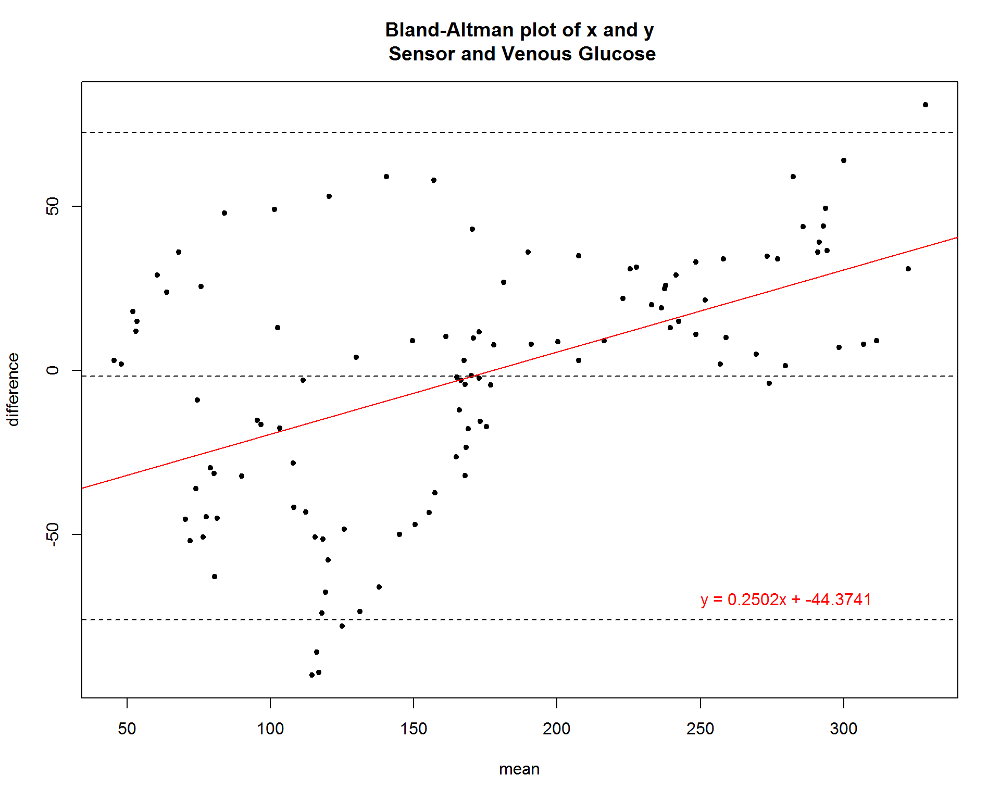

Here we see that the majority of the readings fall within the 95% confidence intervals around 0 difference.  We do note an upward trend in the readings.  At low mean glucose readings, the difference between methods is spread fairly evenly around 0, but at higher glucose levels, the difference is overwhelmingly positive.  Since the difference is Sensor minus Venous Glucose, a positive difference shows the new Sensor method readings are higher than the accepted method Venous readings.

---

##Question 2 - Modeling Data


Measurements of the concentration and absorbance of trace cyanide in waste water samples was gathered by [Meier and Zeund][3] (3). 

####a) Linear Least-Squares Model

The data needed basic pre-processing in order to be read into R.  It was copied and pasted into a text file and the first line (column names) was removed.


```r
#read data
    conc<-read.table("data/conc.txt",header=T,sep=" ")
    colnames(conc)<-c("Concentration","Absorbance")
```


We wish to fit a linear model of the form $y = b_1x + b_0$ to the data. This can be done with the `lm()` function in base-R.  Here we specify that there is a linear relationship between absorbance and concentration.


```r
#use base least squares regression
fit.linear<-lm(Absorbance~Concentration,conc)
intercept<-fit.linear[[1]][[1]]
slope<-fit.linear[[1]][[2]]
fit.linear
```

```
## 
## Call:
## lm(formula = Absorbance ~ Concentration, data = conc)
## 
## Coefficients:
##   (Intercept)  Concentration  
##      0.005902       0.004990
```
We see that the found model has a slope of 0.0049896 and an intercept of 0.0059021.  We can overlay this model on data and examine the goodness of fit.


```r
plot(conc$Concentration,conc$Absorbance,
     xlab=expression(paste("Concentration (",mu,"g/100mL)")),ylab="Absorbance",
     main="Trace Cynaide in Waste Water")
abline(lm(Absorbance~Concentration,conc),col="red",lty=2)
text(200,0,col="red",paste("y = ",round(slope,4),"x + ",round(intercept,4),sep=""))
```

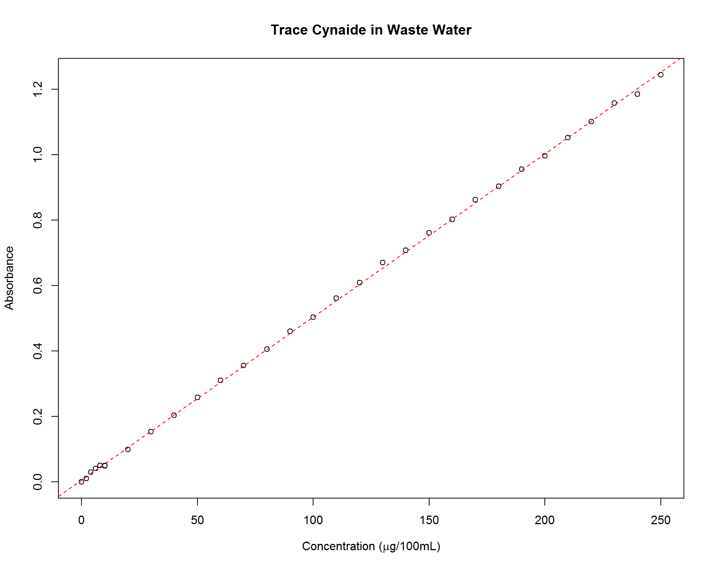


####b) Linear Least-Squares Residuals

It appears that our linear least squares model fits the data well, but we can quantify this belief.


```r
(s.fit.linear<-summary(fit.linear))
```

```
## 
## Call:
## lm(formula = Absorbance ~ Concentration, data = conc)
## 
## Residuals:
##       Min        1Q    Median        3Q       Max 
## -0.017402 -0.005749  0.000400  0.004351  0.016452 
## 
## Coefficients:
##                Estimate Std. Error t value Pr(>|t|)    
## (Intercept)   5.902e-03  1.836e-03   3.214  0.00312 ** 
## Concentration 4.990e-03  1.397e-05 357.124  < 2e-16 ***
## ---
## Signif. codes:  0 '***' 0.001 '**' 0.01 '*' 0.05 '.' 0.1 ' ' 1
## 
## Residual standard error: 0.006501 on 30 degrees of freedom
## Multiple R-squared:  0.9998,	Adjusted R-squared:  0.9998 
## F-statistic: 1.275e+05 on 1 and 30 DF,  p-value: < 2.2e-16
```

```r
#r squared value - standard
```


The usual parameter is the $R^2$ value, here calculated as 0.9998.  Our line has a slope of 0.00499 and an intercept of 0.0059.

We can also look at the residuals directly. A least-squares equation is found by minimizing the residuals (i.e., finding the line that is the closest, on average, to all the points) so the residuals should be small and randomly spread above and below the line.


```r
#find and plot residuals from the linear fit
par(mar=c(5,4,4,2)+0.1,fig=c(0,1,0,1),mfrow=c(1,1))
plot(conc[,1], resid(fit.linear),  ylim=c(-0.020,0.020),
     xlab=expression(paste("Concentration (",mu,"g/100mL)")),ylab="Residuals", main="Residuals of Least Squares Fit\n of Absorbance on Concentration") 
abline(0,0,col="red",lty=2)
```

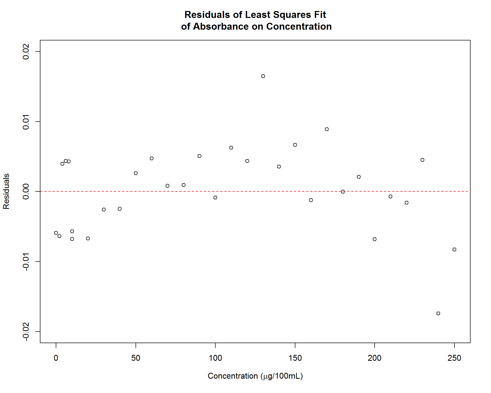

Taking a look at this plot, the residuals are small, but the residuals tend to be positive in the middle concentrations and negative at high concentrations. This means our model under estimates absorbance in the middle concentrations and over estimates absorbance at high concentrations.  There is significant lack of fit.


####c) Additional Terms

This curvature suggests we should investigate a quadratic model by adding a concentration-squared term, `Conc_sq`.


```r
#adding square term
    conc[,3]<-(conc[,1]^2)
    colnames(conc)<-c("Concentration","Absorbance","Conc_sq")

fit.quad<-lm(Absorbance~(Concentration+Conc_sq),data=conc)
intercept<-fit.quad[[1]][[1]]
slope<-fit.quad[[1]][[2]]
sq_term<-fit.quad[[1]][[3]]
s.fit.quad<-summary(fit.quad)
```


```r
#calculate predicted values
#R will not use multiple terms when plotting abline(lm(),...)
pred.quad<-as.data.frame(matrix(seq(-10,250,length.out=10000),ncol=1))
pred.quad[,2]<-(intercept+pred.quad[,1]*slope + pred.quad[,1]*pred.quad[,1]*sq_term)

# plot
par(mar=c(5,4,4,2)+0.1,fig=c(0,1,0,1),mfrow=c(1,1))
plot(conc$Concentration,conc$Absorbance,
         xlab=expression(paste("Concentration (",mu,"g/100mL)")),ylab="Absorbance",
         main="Trace Cynaide in Waste Water")
    abline(lm(Absorbance~Concentration,conc),col="red",lty=2)
    points(pred.quad[,1],pred.quad[,2],type="l",col="blue",lty=1)
    legend("bottomright",bty="n",pch=c(1,NA,NA), lty=c(NA,2,1),
          col=c("black","red","blue"), legend = c("Data","Linear","Quadratic"),cex=1)

# calculate position of inset
    plotdim <- par("plt")
    xleft    = plotdim[1] + 0.02
    xright   = plotdim[1] + (plotdim[2] - plotdim[1])*.30 + 0.02
    ybottom  = plotdim[4] - (plotdim[4] - plotdim[3])*.40 - 0.03
    ytop     = plotdim[4] - 0.03  #

# set position for inset
par(
  fig = c(xleft, xright, ybottom, ytop)
  , mar=c(0,0,0,0)
  , new=TRUE
  )

# add inset
plot(conc$Concentration,conc$Absorbance,xlim=c(0,11),ylim=c(0,.06),xaxt='n',yaxt='n')
    abline(lm(Absorbance~Concentration,conc),col="red",lty=2)
    points(pred.quad[,1],pred.quad[,2],type="l",col="blue",lty=1)
```

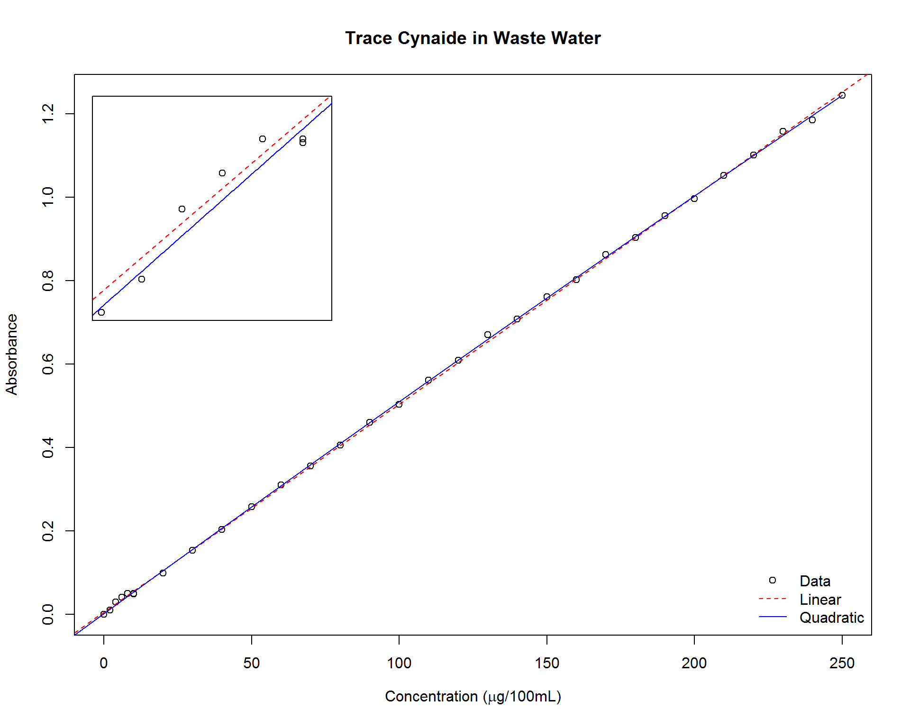

The new $R^2$ value is 0.9999  with our line having a coefficients of 0.00516 and -7.3940101 &times; 10<sup>-7</sup> and an intercept of 0.00153.  

While it's not immediately obvious that the lines are distinct, more so in the inset, it becomes clearer if we instead examine the residuals.


```r
par(mar=c(5,4,4,2)+0.1,fig=c(0,1,0,1),mfrow=c(1,1))
plot(conc[,1], resid(fit.quad),  ylim=c(-0.015,0.015),
     xlab=expression(paste("Concentration (",mu,"g/100mL)")),ylab="Residuals", main="Residuals of Least Squares Fit\n of Absorbance on Concentration") 
abline(0,0,col="blue",lty=2)
```

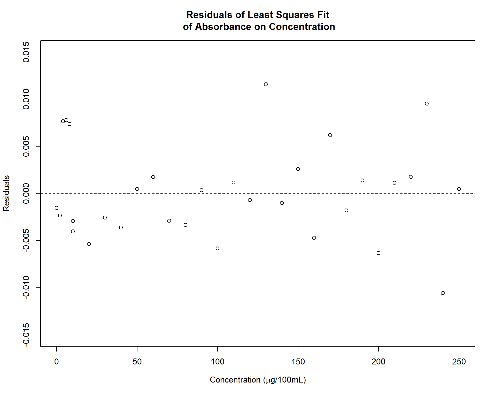
Our $R^2$ has increased, but more importantly a visual examination of our residuals reveals no obvious relationship.

####d) Testing Residuals

Formally, we might like to describe the "randomness" of our residuals.

```r
Fstat<-var.test(conc[,1],resid(fit.linear))
```

---

##Question 3 - Exploring Data
We might wish to explore data before testing an hypotheses.  We wish to perform an exploratory data analysis (EDA) on some various properties of elements to see if we can extract periodic trends.


```r
elem<-read.table("data/homework2-1.csv",sep=",",row.names=1,header=T)
```

####a)Scatterplot

```r
plot(elem)
```

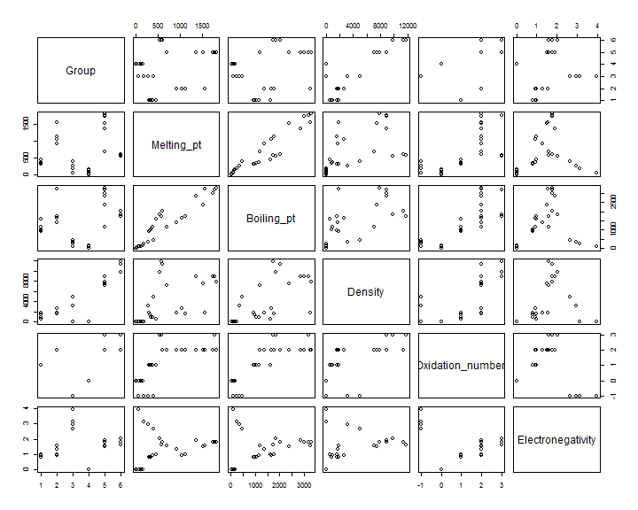

A set of simple scatterplots allows us to quickly examine the data for any obvious trends between any two dimensions in the data.  It seems that Melting Point and Boiling Point are highly correlated. Density is more loosely correlated with Group, Melting Point, and Boiling Point.  We also see at a glance that many of the variables are discreet rather than continuous.

####b)Boxplots

```r
boxplot(elem)
```


These boxplots show a broad range in the data for the Density variable which would overwhelm the other variables, especially Group, Oxidation Number, and Electronegative which range from -1 to 6.  We would want to center (mean = 0) and scale (var = 1) the data.

####c)Hierarchical Cluster Analysis
When looking for trends, we wish to determine which elements are similar taking into account all  variables, or which lie closest to each other when plotted in a high-dimensional space.

To do so we use hierarchical cluster analysis, which groups closest neighbors together and keeps track at what distance the groups merged, with varying methods of determining distance between groups.  We also want to account for our variables having different units and therefore differing scales for means and spreads which will bias the distance measurements towards the larger valued variables.  We can center and scale the data to eliminate this bias (if desirable).


```r
elem_c<-scale(elem, center=T, scale=F) #centered only
elem_a<-scale(elem, center=T, scale=T) #centered and autoscaled
#hcluster on c data complete & ward.D
hc_c_complete<-hclust(dist(elem_c),method="complete")
hc_c_ward<-hclust(dist(elem_c),method="ward.D")
#on autoscale data complete & ward.D
hc_a_complete<-hclust(dist(elem_a),method="complete")
hc_a_ward<-hclust(dist(elem_a),method="ward.D")
```

Here we have performed "complete" (measuring distance between the two farthest points in each group) and "ward" (measuring distance between centroids with a scaling factor) hierarchical cluster analyses on centered and auto-scaled (centered and scaled) data.


```r
par(mfrow=c(2,2))
plot(hc_c_complete, main="Centered - Complete", xlab=NA)
abline(h=3750,lty=2,col=2)
plot(hc_c_ward, main="Centered - Ward",xlab=NA)
abline(h=7000,lty=2, col=2)
plot(hc_a_complete, main="Autoscaled - Complete", xlab=NA)
abline(h=3,lty=2, col=2)
plot(hc_a_ward, main="Autoscaled - Ward", xlab=NA)
abline(h=5,lty=2, col=2)
```

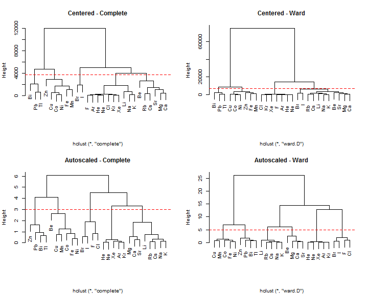

We can see the centered data has a much larger separation between the largest two groups than the auto-scaled data but this is a sign that the range of at least one of the variables is much larger than the others, not that these provide a "better" separation of the elements.

To find groups we look for a large difference in height between when two groups merge and when those groups were themselves created.  For example, in the centered-complete analysis, we see there are clearly two separate groups (Bi, Pb, Tl, Zn, Cu, Co, Ni, Fe) and (Br, I, F, Ar, He, Ne, Cl, Kr, Xe, Li, Na, K, Be, Rb, Cs, Sr, Mg, Ca).  We could argue a separation of 5 groups with a height of approximately 3750, but the choice of height for separation is arbitrary (as it is for all hierarchical cluster analyses).

The centered-ward analysis very clearly separates the same two groups from the centered-complete analysis, but even less clearly separates further groups.  We could argue for the same 5 groups.

The auto-scaled analyses seem to provide more clearly separated groups by accounting for the large differences in the ranges of the variables.  The auto-scaled-complete analysis finds 5 distinct groups cleanly.  The auto-scaled-ward analysis finds 6 very clear groups.  I would argue that the auto-scaled analyses work better here because the we have no *a priori*  reason to bias the data towards the variable with the large range.


Looking at the elements contained in each group 


####d)Principal Components Analysis

Using a principal components analysis (PCA), we can separate transform the data so the axes lie upon the line of maximum variance.  This can help us to identify and visualize separation in the data.  Using auto-scaled elemental data we perform a PCA and plot the eigenvalues to determine how many principal components represent unique information in our data and how many represent noise.

```r
elem_a_pc<-princomp(elem_a,cor=TRUE)
screeplot(elem_a_pc,type="lines", col="red", main ="PCA of Element Data")
```

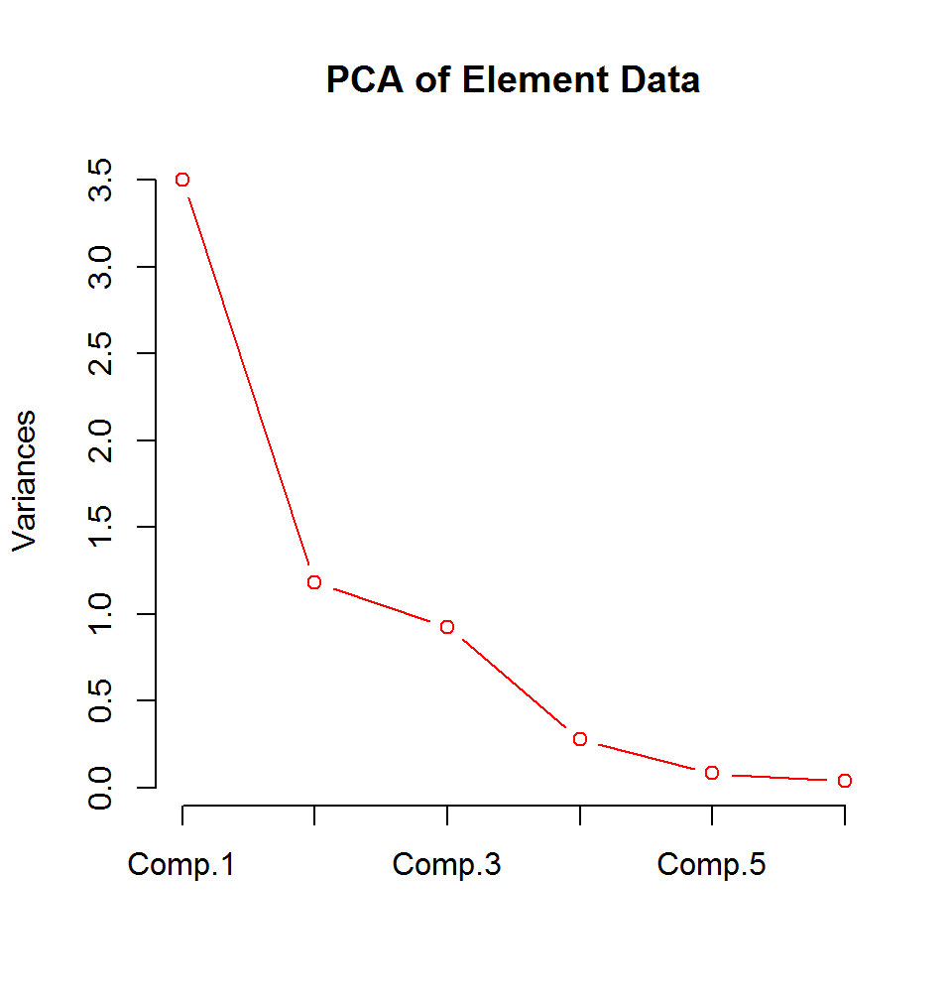

Here we see a large difference in the eigenvalues between components 1 and 2 and components 3 and 4.  We would keep at most 3 components, but it may be possible to separate the data with only two components.


```r
variances <-elem_a_pc$sdev^2/(nrow(elem_a)-1)
totvariances<- sum(variances)
relvars<- variances/totvariances
vars<- 100*round(relvars, digits=3)

plot(elem_a_pc$scores[,1],elem_a_pc$scores[,2],
     xlab=paste("PC#1(",vars[1],"%)", sep=" "),
     ylab=paste("PC#2(",vars[2],"%)",sep=" "),
     main="Scores of Element Data",pch=elem$Group, col=elem$Group)
abline(h=0, col="gray");abline(v=0, col="gray")
text(elem_a_pc$scores[,1], elem_a_pc$scores[,2],labels=rownames(elem),cex=.5, pos=1)
text(elem_a_pc$scores[10,1], elem_a_pc$scores[10,2],labels="F",cex=.5, pos=2)
```

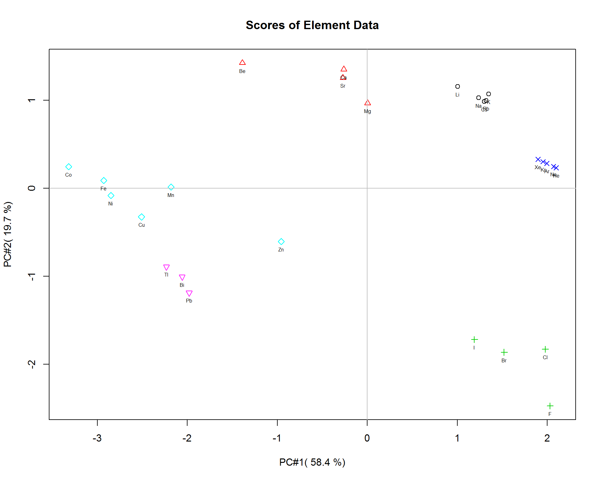

Looking at the first two principal components, we see good separation by group with the exception of groups 5 (3d transition metals) and 6 (6p metals).  Groups 1 (alkali metals) and 1 (rare gases) group tightly within themselves, while groups 2 (alkaline earth metals) and 3 (halogens) are more spread.  Chemically thesee groupings are familiar.  The difference in spread is also expected since the transition metals often have unique properities while the alkali metals and rare gases are very similar in nature.


```r
plot(elem_a_pc$loadings[,1],elem_a_pc$loadings[,2],
     main="Loadings of Element Data",pch=elem$Group, col=elem$Group,xlim=c(-0.52,-.11),
     xlab="Loadings #1",ylab="Loadings #2")
abline(h=0, col="gray");abline(v=0, col="gray")
text(elem_a_pc$loadings[,1], elem_a_pc$loadings[,2],labels=colnames(elem),cex=.5, pos=c(1,1,3,1,4,2))
```

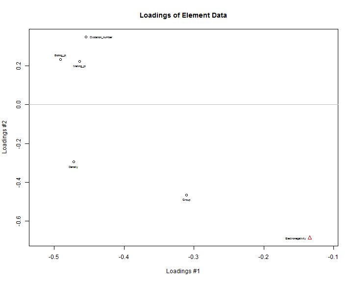
A vast majority of the variance is represented by component 1, but we also see that boiling point, melting point, and oxidation number group noticed in the earlier scatterplot.

####e) Excluding a Variable
Suppose we wished to exlude the variable with high loadings in PC#2.  We would exclude electronegativity as sign is not important.


```r
elem2<-elem[,1:5]
elem2_a<-scale(elem2)
elem2_a_pc<-princomp(elem2_a, cor=T)
screeplot(elem2_a_pc,type="lines", col="red", main ="PCA of Element Data")
```

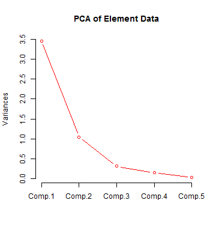
We see that the about of variance explained by each component has changed, and that it seems likely we will need 3 components to separate the data.


```r
variances <-elem2_a_pc$sdev^2/(nrow(elem2_a)-1)
totvariances<- sum(variances)
relvars<- variances/totvariances
vars<- 100*round(relvars, digits=3)

par(mfrow=c(1,2))
plot(elem2_a_pc$scores[,1],elem2_a_pc$scores[,2],
     xlab=paste("PC#1 (",vars[1],"%)", sep=""),
     ylab=paste("PC#2 (",vars[2],"%)",sep=""),
     main="Scores of Element Data\n without Electronegativity",pch=elem2$Group, col=elem2$Group)
abline(h=0, col="gray");abline(v=0, col="gray")
text(elem2_a_pc$scores[,1], elem2_a_pc$scores[,2],labels=rownames(elem),cex=.5, pos=1)
text(elem2_a_pc$scores[6,1], elem2_a_pc$scores[6,2],labels="Be",cex=.5, pos=4)

plot(elem2_a_pc$scores[,1],elem2_a_pc$scores[,3],
     xlab=paste("PC#1 (",vars[1],"%)", sep=""),
     ylab=paste("PC#3 (",vars[3],"%)",sep=""),
     main="Scores of Element Data\n without Electronegativity",pch=elem2$Group, col=elem2$Group)
abline(h=0, col="gray");abline(v=0, col="gray")
text(elem2_a_pc$scores[,1], elem2_a_pc$scores[,3],labels=rownames(elem),cex=.5, pos=1)
text(elem2_a_pc$scores[10,1], elem2_a_pc$scores[10,3],labels="F",cex=.5, pos=2)
```

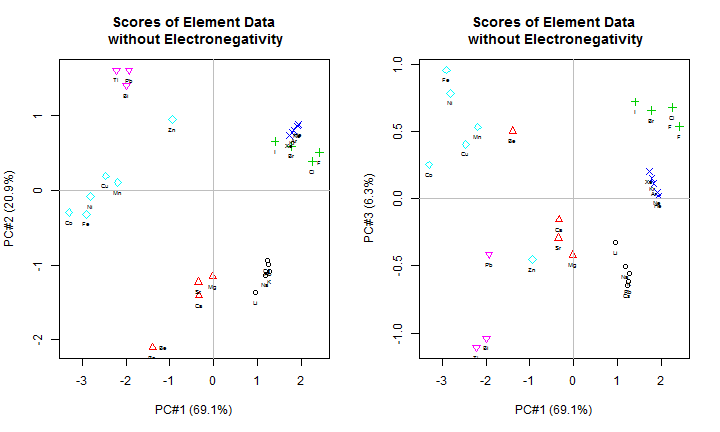
Plotting the first two components, we do indeed see that while most groups separate well, the rare gases and the halogens do not.  However plotting components 1 and 3 separate the rare gases and the halogens, so three principal components are necessary to separate the data if electronegativity is removed.


```r
par(mfrow=c(1,2))
plot(elem2_a_pc$loadings[,1],elem2_a_pc$loadings[,2],
     main="Loadings of Element Data", pch=elem$Group, col=elem$Group,
     xlab="Loadings #1", ylab="Loadings #2")
abline(h=0, col="gray");abline(v=0, col="gray")
text(elem2_a_pc$loadings[,1], elem2_a_pc$loadings[,2],labels=colnames(elem2),cex=.5, 
     pos=c(2,4,4,4,4))
plot(elem2_a_pc$loadings[,1],elem2_a_pc$loadings[,3],
     main="Loadings of Element Data", pch=elem$Group, col=elem$Group,
     xlab="Loadings #1", ylab="Loadings #2")
abline(h=0, col="gray");abline(v=0, col="gray")
text(elem2_a_pc$loadings[,1], elem2_a_pc$loadings[,3],labels=colnames(elem2),cex=.5, 
     pos=c(2,4,4,4,4))
```

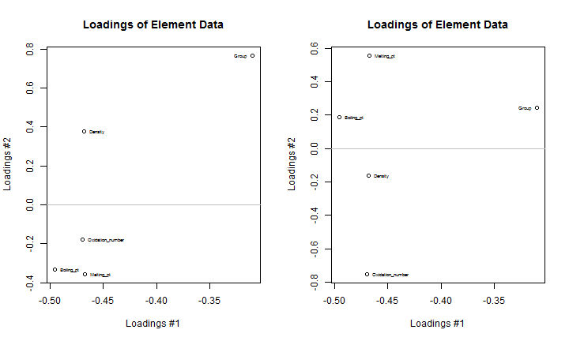


##Question 4 - PCA for Identification

A common use for PCA is identification of samples via comparison to a known dataset.  Here we are examining a series of two-types optical filters, made and measured at NIST, where some have gone unlabeled ('Y'-type).

####a) Load and Examine data

```r
opt<-read.csv("data/homework2-3.csv")
plot(opt)
```

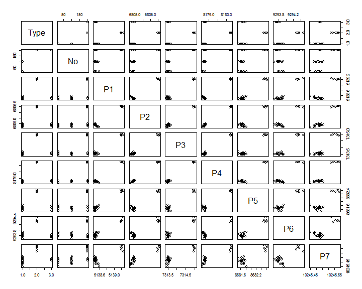
A quick look at the data reveals a strong correlation and separation in the P-variables.  Type would be excluded from the PCA. 


```r
str(opt)
```

```
## 'data.frame':	35 obs. of  9 variables:
##  $ Type: Factor w/ 3 levels "2035","2035a",..: 1 1 1 1 1 1 1 1 1 1 ...
##  $ No  : int  18 18 18 18 18 18 101 101 101 101 ...
##  $ P1  : num  5139 5138 5138 5138 5138 ...
##  $ P2  : num  6805 6805 6805 6805 6805 ...
##  $ P3  : num  7313 7313 7313 7314 7314 ...
##  $ P4  : num  8179 8179 8179 8179 8179 ...
##  $ P5  : num  8682 8682 8682 8682 8682 ...
##  $ P6  : num  9294 9294 9294 9294 9294 ...
##  $ P7  : num  10245 10245 10246 10246 10246 ...
```

```r
summary(opt)
```

```
##     Type          No              P1             P2             P3      
##  2035 :24   Min.   : 18.0   Min.   :5138   Min.   :6805   Min.   :7313  
##  2035a: 6   1st Qu.:101.0   1st Qu.:5138   1st Qu.:6805   1st Qu.:7314  
##  Y    : 5   Median :102.0   Median :5138   Median :6805   Median :7314  
##             Mean   :118.5   Mean   :5139   Mean   :6805   Mean   :7314  
##             3rd Qu.:200.0   3rd Qu.:5139   3rd Qu.:6805   3rd Qu.:7314  
##             Max.   :201.0   Max.   :5139   Max.   :6807   Max.   :7315  
##        P4             P5             P6             P7       
##  Min.   :8179   Min.   :8682   Min.   :9294   Min.   :10245  
##  1st Qu.:8179   1st Qu.:8682   1st Qu.:9294   1st Qu.:10246  
##  Median :8179   Median :8682   Median :9294   Median :10246  
##  Mean   :8179   Mean   :8682   Mean   :9294   Mean   :10246  
##  3rd Qu.:8179   3rd Qu.:8682   3rd Qu.:9294   3rd Qu.:10246  
##  Max.   :8180   Max.   :8683   Max.   :9294   Max.   :10246
```

```r
(apply(opt[,3:9],2,var))
```

```
##          P1          P2          P3          P4          P5          P6 
## 0.078171429 0.389810588 0.297716303 0.309059664 0.125266387 0.042854958 
##          P7 
## 0.003591092
```
The data needs to be centered, but looking at the variance, I would argue it should not be scaled.

####b) Exclude "Y" and Pre-process data

```r
#split out "unknown/type-y data"
opt2<-opt[opt$Type != "Y",]
opty<-opt[opt$Type == "Y",]

opt3<-opt2[,3:9]
opt3_means<-colMeans(opt3)
opt3_var<-apply(opt3,2,var)
opt3<-scale(opt3, scale=F)
```
The data was split into known and unknown filters.  Type was excluded as we do not wish to bias the PCA.  No was also excluded since this is highly correlated with Type (possibly lot numbers). The data was mean-centered only, not scaled.

####c) Preform PCA. Plot scores and labels

```r
opt3_c_pc<-princomp(opt3,cor=T)
plot(opt3_c_pc)
```

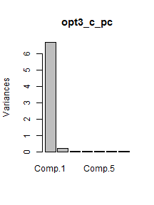

A plot of the variances shows the vast majority of the variance lies in the first principal component, with very little in the second and almost none in the third through seventh.  Arguably, this data can be separate with only one principal component (as was seen in the scatterplot before processing), but we will plot two simply to easier visualization.


```r
variances <-opt3_c_pc$sdev^2/(nrow(opt3)-1)
totvariances<- sum(variances)
relvars<- variances/totvariances
vars<- 100*round(relvars, digits=3)

plot(opt3_c_pc$scores[,1],opt3_c_pc$scores[,2], col=as.factor(opt2$Type), xlab=paste("PC#1 - ",vars[1],"% of Variance"), ylab=paste("PC#2 - ",vars[2],"% of Variance"))
abline(h=0, col="gray")
abline(v=0, col="gray")
text(opt3_c_pc$scores[,1],opt3_c_pc$scores[,2],labels=rownames(opt3),cex=.5, pos=4)
legend("bottom",inset=0,legend=c("2305","2305a"),col=c("black","red"), pch=1,cex=1,horiz=T)
```

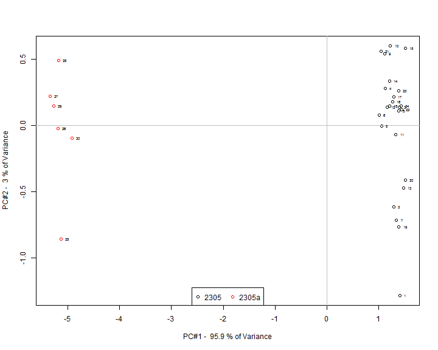


####d) Loadings

```r
plot(opt3_c_pc$loadings[,1],opt3_c_pc$loadings[,2])
abline(h=0, col="gray")
abline(v=0, col="gray")
text(opt3_c_pc$loadings[,1],opt3_c_pc$loadings[,2],labels=colnames(opt3),cex=.5,pos=c(4,4,4,4,4,4,2))
```

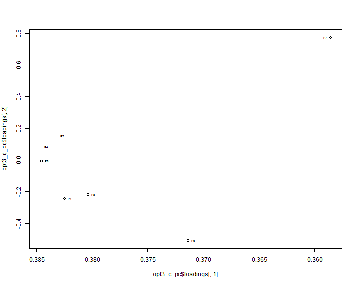
Loadings which are different from 0, contribute to the differences in the filters.  If only one measurement could be taken, P3 would be optimal.  P7 contributes the least to the difference in filters along the first principal component, which explains an overwhelming amount (96%) of the variance.

####e) Project Y samples onto PCA model

We need to pre-process the "Y"-type filters identically to the known filters (using the same mean and variances for scaling as necessary).

```r
opty<-opt[opt$Type=="Y",]
scalec<-attributes(opt3)$"scaled:center"
opty_c<-opty[,3:9]
opty_c<-scale(opty_c,center=scalec,scale=F)
```

We then project the data onto the new principal component axes found with the known data using the loadings.


```r
newscores<-opty_c%*%opt3_c_pc$loadings
```

Finally we plot the new data as see which type it more closely resembles.

```r
plot(opt3_c_pc$scores[,1],opt3_c_pc$scores[,2], col=as.factor(opt2$Type), xlab=paste("PC#1 - ",vars[1],"% of Variance"), ylab=paste("PC#2 - ",vars[2],"% of Variance"))
abline(h=0, col="gray")
abline(v=0, col="gray")
text(opt3_c_pc$scores[,1],opt3_c_pc$scores[,2],labels=rownames(opt3),cex=.5, pos=3)
legend("bottom",inset=0,legend=c("2305","2305a","Y"),col=c("black","red","green"), pch=1,cex=1)
points(newscores[,1],newscores[,2],col=3)
```

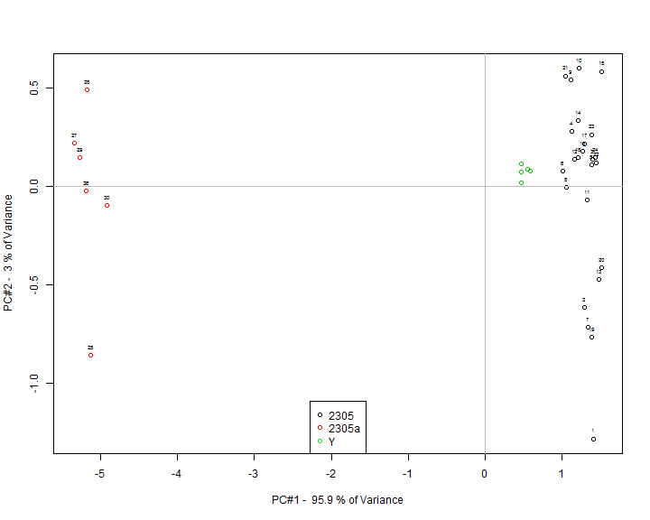
Here, the "Y"-type filters closely resemble "2305"-type filters, but do seem to have slight differences, perhaps as a separate production run, however, they are clearly not "2305a"-type filters.


##Question 5 - Determining differences between Fire Ants

Fire ants can be distinguished through hydrocarbon signals.  Using 5 chromatographic hydrocarbon peaks, we wish to distinguish between two types of fire ant.

####a) Load and Preprocess Data

```r
ants<-read.csv("data/homework2-4.csv")
summary(ants)
```

```
##        Type     heptacosane      X13.methylheptacosane
##  Forager :51   Min.   :  1.008   Min.   :  1.038      
##  Reserver:50   1st Qu.:  2.221   1st Qu.:  2.049      
##                Median :  3.594   Median :  3.770      
##                Mean   :  5.719   Mean   :  5.596      
##                3rd Qu.:  6.344   3rd Qu.:  6.231      
##                Max.   :150.540   Max.   :125.320      
##  X13.15.dimethylheptacosane X3.methylheptacosane X3.9.dimethylheptacosane
##  Min.   :  1.016            Min.   :  1.176      Min.   :  1.018         
##  1st Qu.:  2.309            1st Qu.:  4.719      1st Qu.:  3.870         
##  Median :  4.393            Median :  7.268      Median :  5.674         
##  Mean   :  6.164            Mean   :  8.556      Mean   :  7.177         
##  3rd Qu.:  6.749            3rd Qu.:  9.212      3rd Qu.:  8.041         
##  Max.   :165.780            Max.   :187.230      Max.   :146.340
```
A quick look at the data shows the type of ant (Forager/Reserver) is located in column 1 and should be removed for PCA.


```r
ants2<-as.matrix(ants[,2:6])
plot(ants)
```

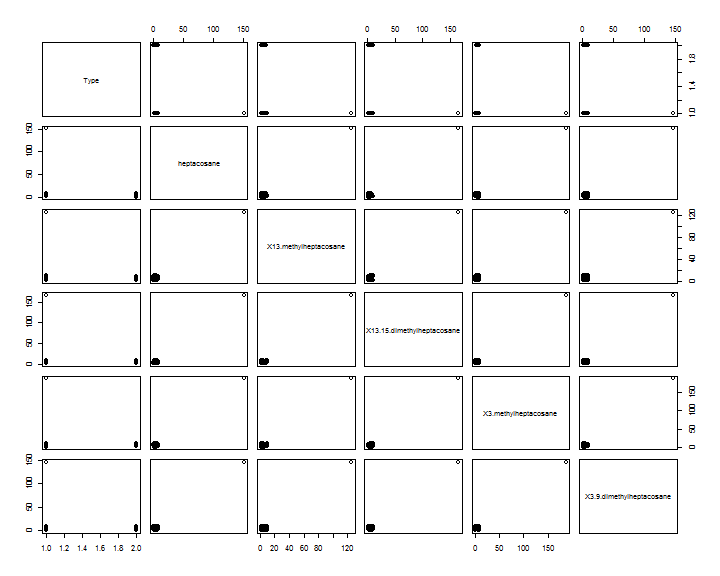

The scatterplots show a clear outlier, ant #1, in all categories.


```r
ants_out<-ants[-1,]
ants_out2<-ants_out[,-1]
plot(ants_out2)
```

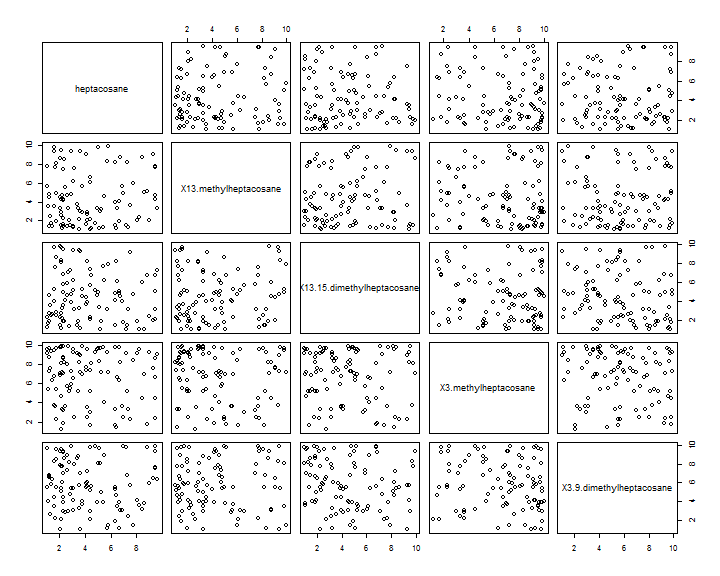
Looking at the data without the outlier, no obvious trends appear.


```r
boxplot(ants_out2)
```

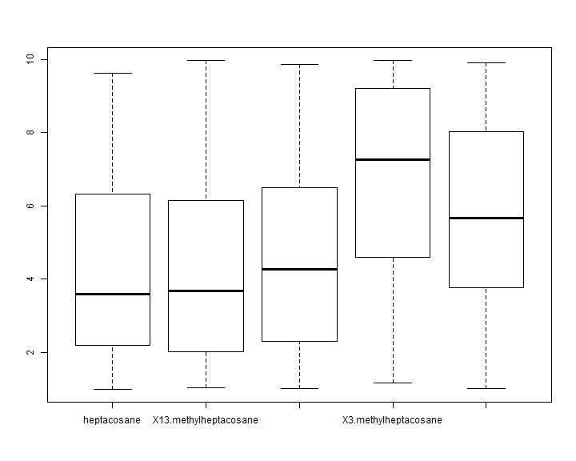

```r
apply(ants_out2,2,var)
```

```
##                heptacosane      X13.methylheptacosane 
##                   6.241634                   7.464978 
## X13.15.dimethylheptacosane       X3.methylheptacosane 
##                   6.558687                   7.123367 
##   X3.9.dimethylheptacosane 
##                   6.598363
```
The variances are close enough that auto-scale may be not be helpful for PCA.


```r
ants_c<-scale(ants_out2, scale=F)
ants_a<-scale(ants_out2, scale=T)
```

####b) Distance between ants and centroid

We can find the centroid simply by finding the mean for each variable.

```r
ants_forager<-ants_out[ants_out$Type=="Forager",2:6]
ants_reserver<-ants_out[ants_out$Type=="Reserver",2:6]
ants_forg_cent<-colMeans(ants_forager)
ants_res_cent<-colMeans(ants_reserver)

par(mfrow=c(1,2))
plot(ants_forager[,1]~ants_forager[,2], 
     main="Forager", xlab="heptacosane", ylab="methylheptacosane")
points(ants_forg_cent[1],ants_forg_cent[2],col="green")

plot(ants_reserver[,1]~ants_reserver[,2], col='red', 
     main="Reserver", xlab="heptacosane", ylab="methylheptacosane")
points(ants_res_cent[1],ants_res_cent[2],col='green')
```

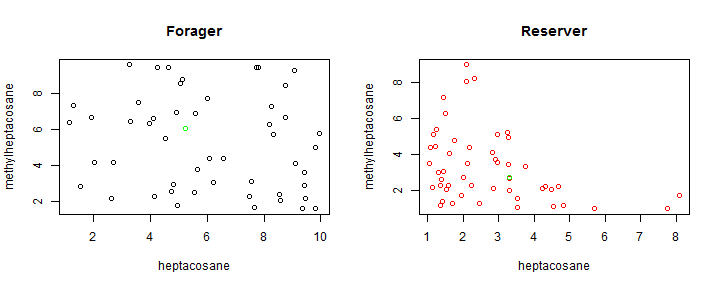
Here are the centroids for each type of ant in the first two dimensions.  We can write a quick function to measure the euclidean distance between a single point (point) and a set of points (y).


```r
#euclidean distance function
e_dist<-function(point,y){
    dist_vect<-NULL
    for(i in 1:length(y[,1])){
            a<-y[i,]-point
            a<-a*a
            a<-sqrt(sum(a))
            dist_vect<-append(dist_vect,a)
        }
    dist_vect
    }

#run function
edist_for<-e_dist(ants_forg_cent, ants_out[,2:6])
edist_res<-e_dist(ants_res_cent, ants_out[,2:6])

par(mfrow=c(1,1))
plot(edist_for,edist_res,col=ants_out$Type)
legend('topleft', col=c("black","red"), legend=c("Forager","Reserver"),pch=1)
```


#dist calculates a distance matrix
#if we want only the distances from a certain point
#we can put that point in the first row to makes a (n+1 x p) matrix
#and select only the first n distances calcualted
ants2<-ants_out[,2:6]
ants2<-rbind(ants_forg_cent,ants2)
a<-length(ants_out[,1])
b<-head(dist(ants2),a)

ants2<-ants_out[,2:6]
ants2<-rbind(ants_res_cent,ants2)
a<-length(ants_out[,1])
b<-head(dist(ants2),a)


####c) Determine Malhalanobis Distances


```r
#mahalanobis distance
#sqrt(x-u)Sx(x-u)
ants2<-ants_out[,2:6]
ants_cov<-cov(ants2)
mdist_for<-mahalanobis(ants2,ants_forg_cent,ants_cov)
mdist_res<-mahalanobis(ants2,ants_res_cent,ants_cov)

plot(mdist_for,mdist_res)
```

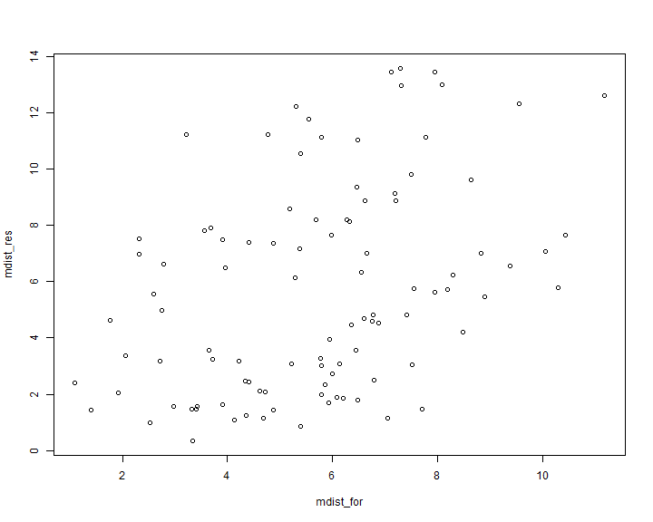

####d) Calculate Assignments using Distance


```r
#for each distance type
#chose smaller distance and assign that type
#find percentage of true

euc<-as.data.frame(cbind(ants$Type,edist_for,edist_res,2,0))
colnames(euc)<-c("Type","edist_for","edist_res","Predict","Match")

euc[edist_for<edist_res,4]<-1
euc[euc$Type==euc$Predict,5]<-1
text1<-summary(euc[,5])[4]

plot(edist_for,edist_res,col=euc$Type,pch=euc$Predict,xlim=c(2,10),ylim=c(2,11))
text(8,2.2,labels=paste0(text1," % agreement"),cex=.75)
legend('topleft', col=c("black","red"), legend=c("Actual Forager","Actual Resever"),pch=1)
legend('bottomleft', col="grey", legend=c("Predicted Forager","Predicted Resever"),pch=c(1,2))
```

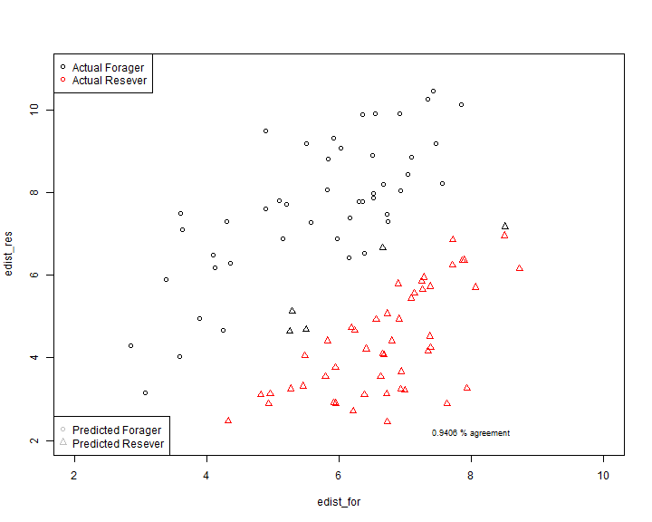

```r
mah<-as.data.frame(cbind(ants$Type,mdist_for,mdist_res,2,0))
colnames(mah)<-c("Type","mdist_for","mdist_res","Predict","Match")

mah[mdist_for<mdist_res,4]<-1
mah[mah$Type==mah$Predict,5]<-1
text1<-summary(mah[,5])[4]

plot(mdist_for,mdist_res,col=mah$Type,pch=mah$Predict,xlim=c(0,12),ylim=c(0,14))
text(10,1,labels=paste0(text1," % agreement"),cex=.75)
legend('topright', col=c("black","red"), legend=c("Actual Forager","Actual Resever"),pch=1)
legend('bottomright', col="grey", legend=c("Predicted Forager","Predicted Resever"),pch=c(1,2))
```

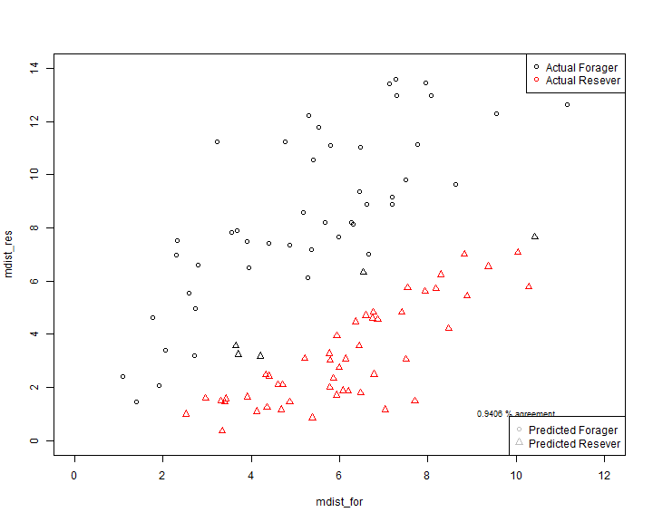

####e) PCA


##References
[1]: http://www.sciencedirect.com/science/article/pii/S0140673695917489 "JM Bland and DG Altman, Lancet (1995) 346(8982) 1085-1087" 
1. "JM Bland and DG Altman, Lancet (1995) 346(8982) 1085-1087" 

[2]: http://www.r-bloggers.com/example-9-34-bland-altman-type-plot/ 
"Kleinman, K. "Example 9.34: Bland-Altman type plot" June 5, 2012." 
2. Kleinman, K. "Example 9.34: Bland-Altman type plot" June 5, 2012.  http://www.r-bloggers.com/example-9-34-bland-altman-type-plot/

[3]:
3. 
