```r
library(knitr)
```


##Question 2 - arrows

```r
data<-read.csv("data/arrows.csv")
str(data)
```

```
## 'data.frame':	75 obs. of  13 variables:
##  $ SampleID: Factor w/ 59 levels "ANA-1","ANA-2",..: 28 20 23 24 21 22 25 27 26 19 ...
##  $ Class   : int  1 1 1 1 1 1 1 1 1 1 ...
##  $ Quarry  : Factor w/ 5 levels "AN","BL","K",..: 3 3 3 3 3 3 3 3 3 3 ...
##  $ Fe      : int  1100 1173 1164 1030 1077 1080 1020 1050 1100 1069 ...
##  $ Ti      : int  390 417 404 373 373 403 360 396 373 375 ...
##  $ Ba      : int  55 54 56 59 55 53 59 56 53 51 ...
##  $ Ca      : int  920 961 916 920 888 919 883 924 910 958 ...
##  $ K       : int  460 441 446 487 455 442 473 482 477 429 ...
##  $ Mn      : int  45 47 42 38 38 41 43 48 51 42 ...
##  $ Rb      : int  120 135 120 128 97 133 119 140 137 100 ...
##  $ Sr      : int  57 55 58 53 51 60 40 74 61 51 ...
##  $ Y       : int  58 60 45 58 54 45 50 71 58 47 ...
##  $ Zr      : int  142 145 148 138 145 155 134 157 152 128 ...
```

```r
data2<-data

#12 unknowns located last
ukn<-data[64:75,]
data<-data[-(64:75),]

#property information (sampleID, Class, Quarry) in first 3 columns
prop<-data[,1:3]
data<-as.matrix(data[,-(1:3)],ncol=10)
ukn_prop<-ukn[,1:3]
ukn_data<-as.matrix(ukn[,-(1:3)],nrow=12)

par(mfrow=c(1,1))
boxplot(data)
```

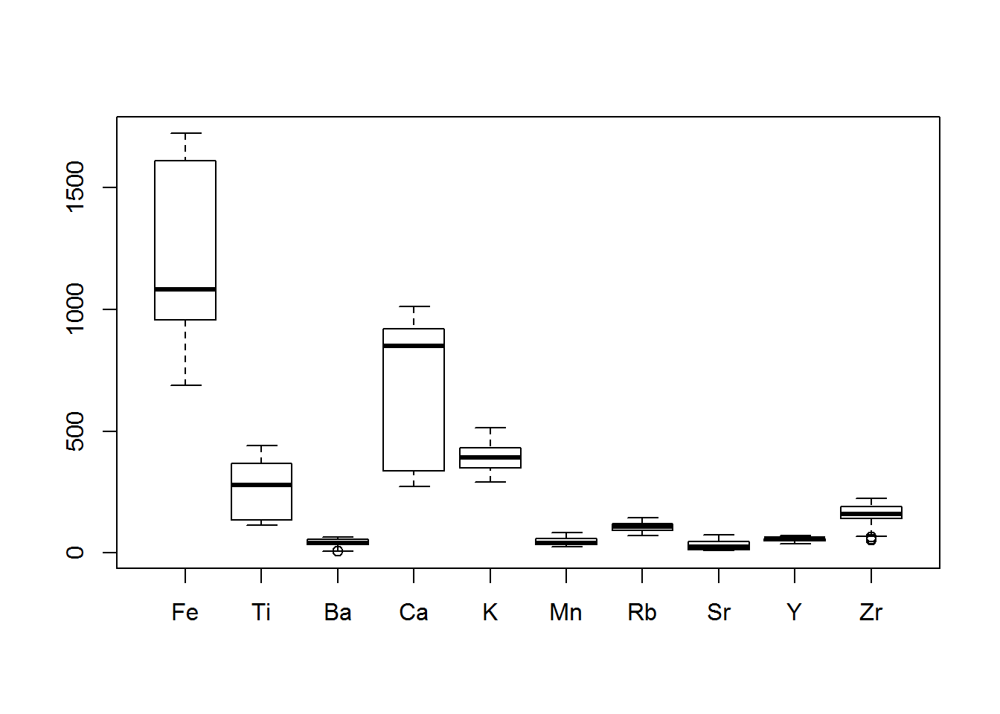

A boxplot of the data shows a wide spread in the values for the different elements as well as vastly differing variances.  Auto-scaling this data will probably be necessary.


```r
plot(as.data.frame(data))
```

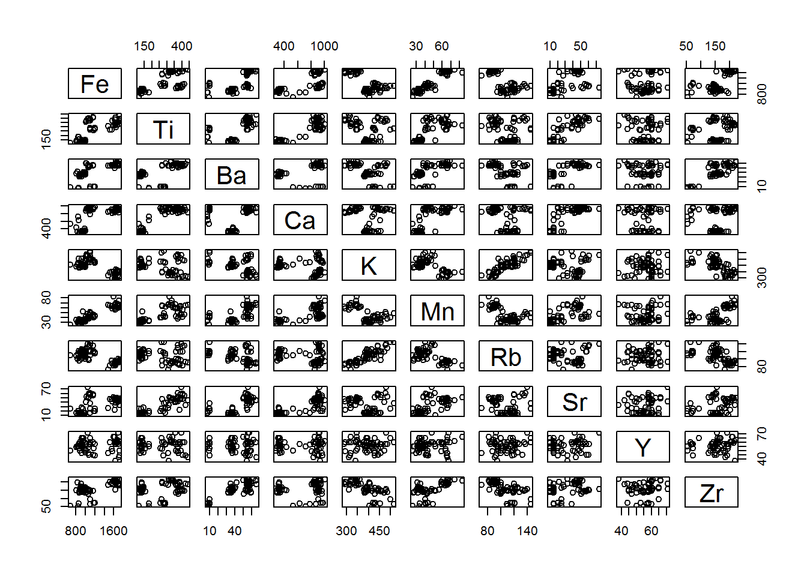

Plotting the elements against each other show several loose correlations, for instance between K and Rb suggesting there may be replicate information.  We also see several distinct groups separated by only two elements.  


```r
pca<-princomp(data)
plot(pca)
```

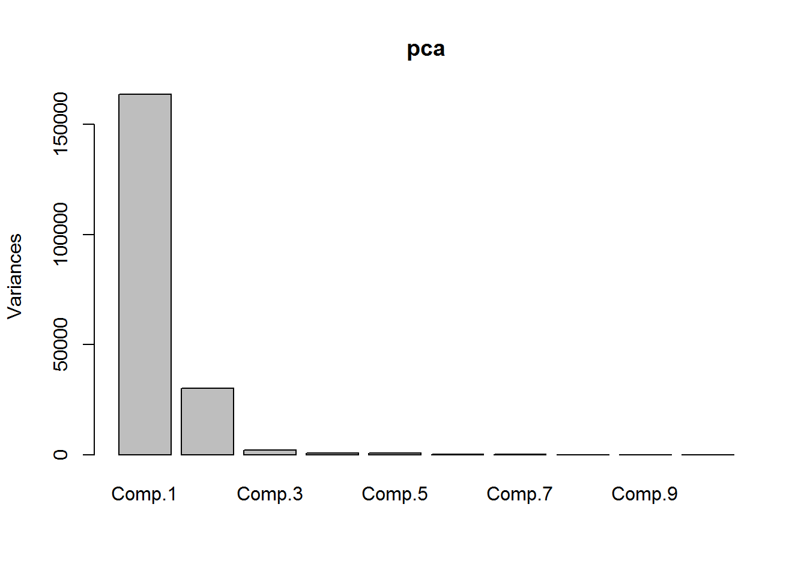

Doing a quick pca on the data, we find 3 principal components.


```r
plot(pca$scores[,1],pca$scores[,2],col=prop[,3])
text(pca$scores[,1],pca$scores[,2],labels=prop[,1],cex=.5,pos=1)
legend("bottomright",col=1:4,pch=1,c("AN", "BL", "K", "SH"),bty='n',y.intersp=.5)
```

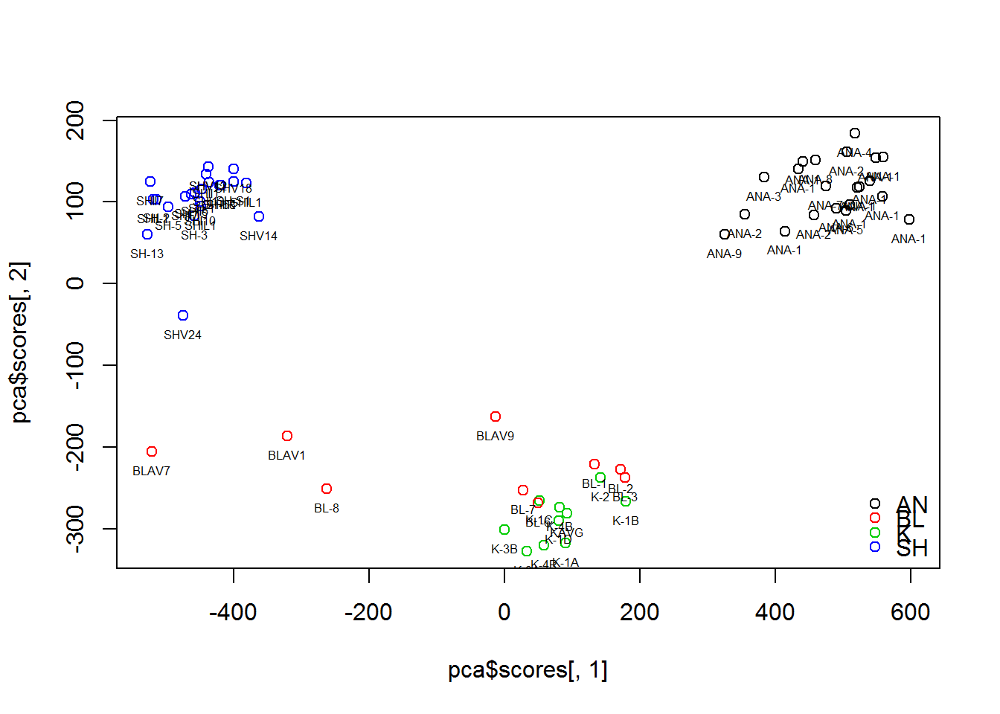

```r
plot(pca$scores[,2],pca$scores[,3],col=prop[,3])
text(pca$scores[,2],pca$scores[,3],labels=prop[,1],cex=.5,pos=1)
legend("bottomright",col=1:4,pch=1,c("AN", "BL", "K", "SH"),bty='n',y.intersp=.5)
```

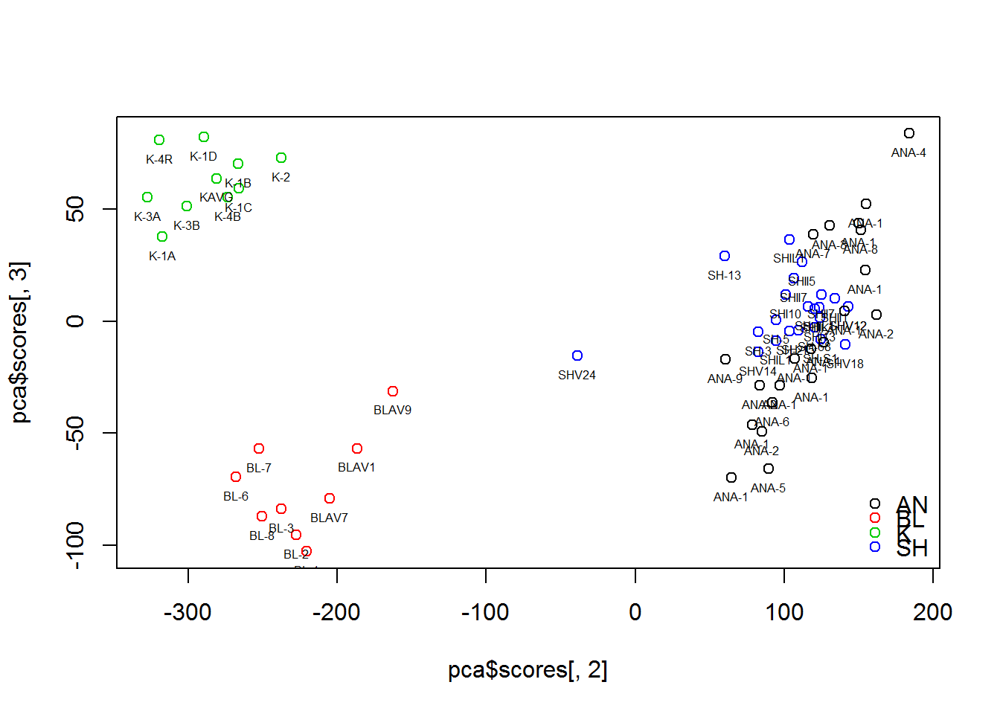

The first two components creates tight clusters for AN, SH, and K samples (with the exception of SHV24), however the BL samples are more widespread and do not separate from the K samples.  The K and BL samples do separate cleanly with the addition of the third principal component.


```r
par(mfrow=c(1,2))
plot(pca$loadings[,1],pca$loadings[,2], xlab="PC1 - 82.9%", ylab="PC2 - 15.2%")
text(pca$loadings[,1],pca$loadings[,2],labels=colnames(data))
abline(h=0,v=0)

plot(pca$loadings[,2],pca$loadings[,3], xlab="PC1 - 82.9%", ylab="PC3 - 1.01%")
text(pca$loadings[,2],pca$loadings[,3],labels=colnames(data))
abline(h=0,v=0)
```

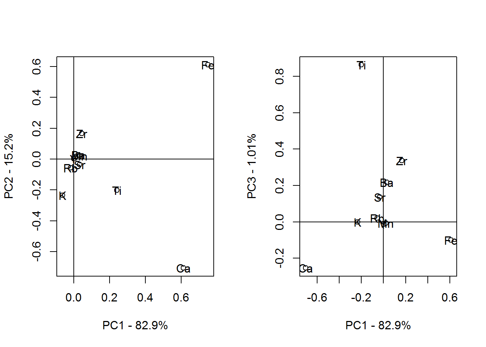

We see that Fe and Ca contribute the most to PC1 which contains the vast majority of the variance.  Ti contributes the most to PC3 which is necessary to separate the BL and K groups.


####b) Auto-scaled Data

As mentioned after the boxplot, we may wish to autoscale the data.


```r
data_a<-scale(data)
center<-attributes(data_a)[[3]]
scale<-attributes(data_a)[[4]]
pcaa<-princomp(data_a)
par(mfrow=c(1,1))
plot(pcaa)
```

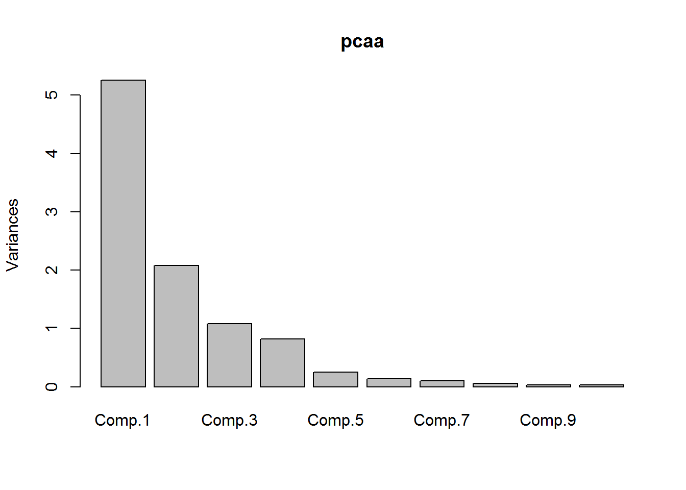


```r
plot(pcaa$scores[,1],pcaa$scores[,2],col=prop[,3])
text(pcaa$scores[,1],pcaa$scores[,2],labels=prop[,1],cex=.5,pos=1)
legend("bottomleft",col=1:4,pch=1,c("AN", "BL", "K", "SH"),bty='n',y.intersp=.5)
```

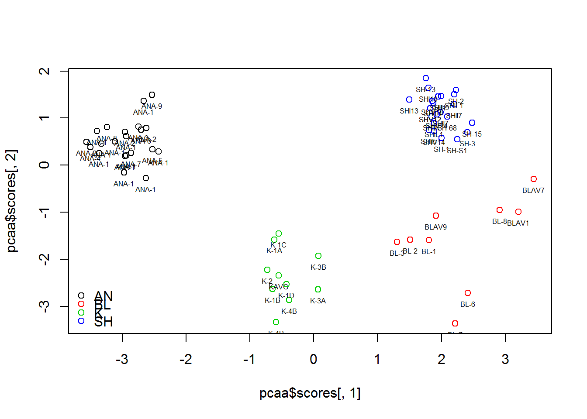

With the auto-scaled data we see clear separation of all the groups with only the first two components.  We still see a wide spread in the BL group


####c) Hierarchical Clustering


```r
#autoscaled data
label<-prop[,3]
label<-as.character(label)
hc1<-hclust(dist(data_a),"ward.D")
plot(hc1,labels=prop[,1],cex=.8)
```

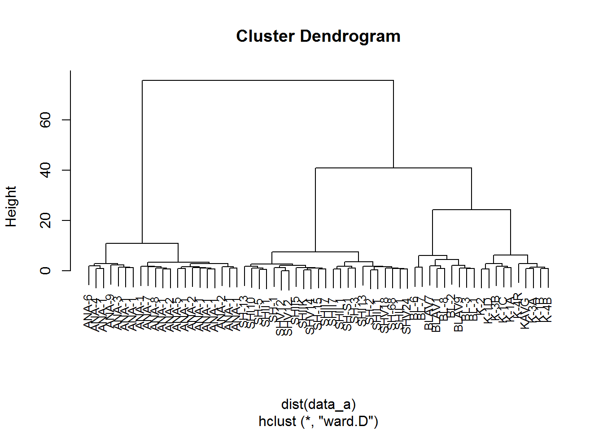

With auto-scaled data and using Ward's method we do see clean separation of the quarries.


####d) Projection of unknown samples into PCA and Clustering
Now that we have created models which separate our known samples, we wish to project our unknown samples into these models.

#####1)PCA - unscaled
Since the original PCA did not scale or center the data, the unknown samples can be projected simply by multiplying by the loadings (and centering with the center from the known data pca).


```r
test<-scale(data%*%pca$loadings,scale=F)
ukn_pca<-ukn_data%*%pca$loadings
ukn_pca<-scale(ukn_pca,center=attributes(test)$'scaled:center',scale=F)

plot(pca$scores[,1],pca$scores[,2],col=prop[,3],xlim=c(-600,600),ylim=c(-370,200))
points(ukn_pca[,1],ukn_pca[,2],col=5,pch=17)
text(pca$scores[,1],pca$scores[,2],labels=prop[,1],cex=.5,pos=1)
text(ukn_pca[,1],ukn_pca[,2],pch=17, labels=ukn_prop[,1],cex=.5,pos=1)
legend("right",col=1:5,pch=c(1,1,1,1,17),c("AN", "BL", "K", "SH","unknown"),bty='n',y.intersp=.5)
```

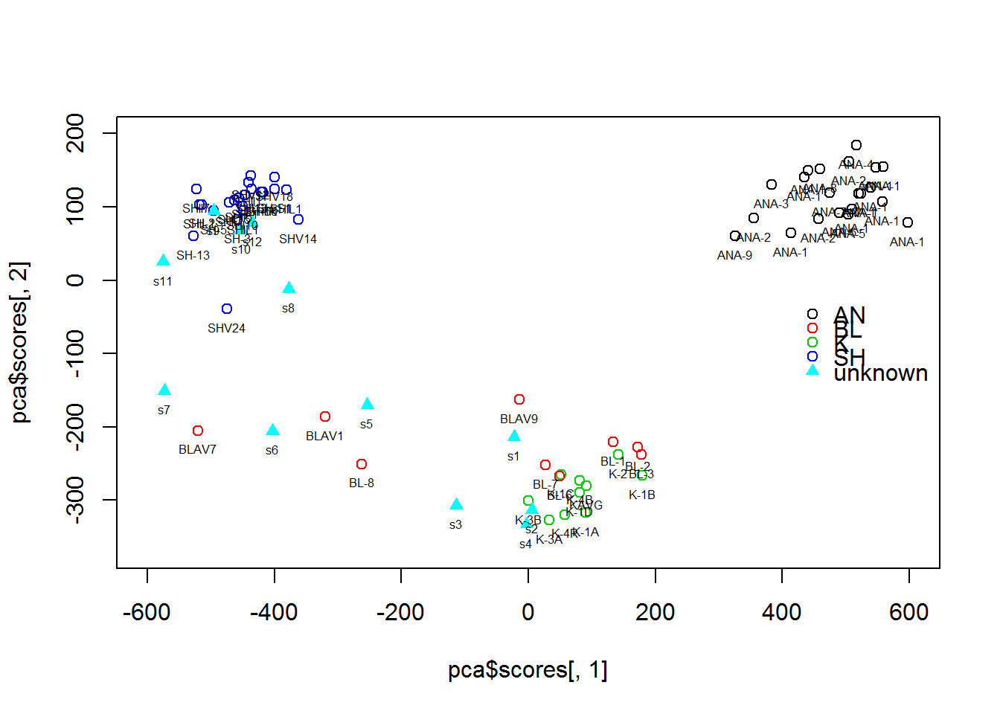

```r
plot(pca$scores[,2],pca$scores[,3],col=prop[,3],xlim=c(-370,200),ylim=c(-125,100))
points(ukn_pca[,2],ukn_pca[,3],col=5,pch=17)
text(pca$scores[,2],pca$scores[,3],labels=prop[,1],cex=.5,pos=1)
text(ukn_pca[,2],ukn_pca[,3],pch=17, labels=ukn_prop[,1],cex=.5,pos=1)
legend("left",col=1:5,pch=c(1,1,1,1,17),c("AN", "BL", "K", "SH","unknown"),bty='n',y.intersp=.5)
```

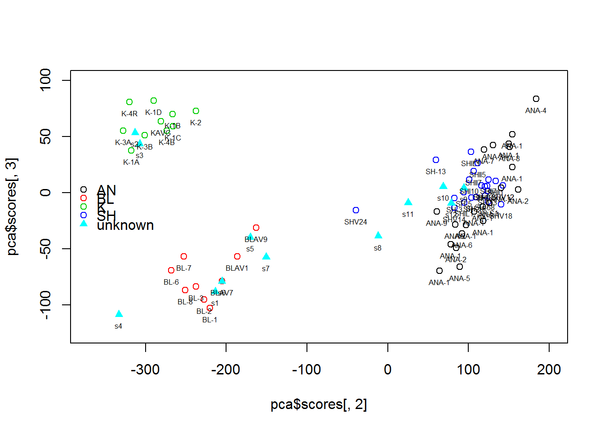

With the unscaled data we find 5 samples (s8,s9,s10,s11,s12) which would be assigned to the SH quarry.  Using PC3 we would separate 2 samples (s2,s3) as from the K quarry and 5 samples (s1,s4,s5,s6,s7) as from the BL quarry.

```r
assignpca<-c("BL","K","K","BL","BL","BL","BL","SH","SH","SH","SH","SH")
```

#####2.) Auto-scaled PCA

We should hopefully observe the same assignments using autoscaled data.


```r
ukn_data_a<-scale(ukn_data,center,scale)
ukn_pcaa<-ukn_data_a%*%pcaa$loadings
plot(pcaa$scores[,1],pcaa$scores[,2],col=prop[,3],ylim=c(-4,2.5))
points(ukn_pcaa[,1],ukn_pcaa[,2],col=5,pch=17)
text(pcaa$scores[,1],pcaa$scores[,2],labels=prop[,1],cex=.5,pos=1)
text(ukn_pcaa[,1],ukn_pcaa[,2],labels=ukn_prop[,1],cex=.5,pos=1)
legend("bottomleft",col=1:5,pch=c(1,1,1,1,17),c("AN", "BL", "K", "SH","unknown"),bty='n',y.intersp=.5)
```

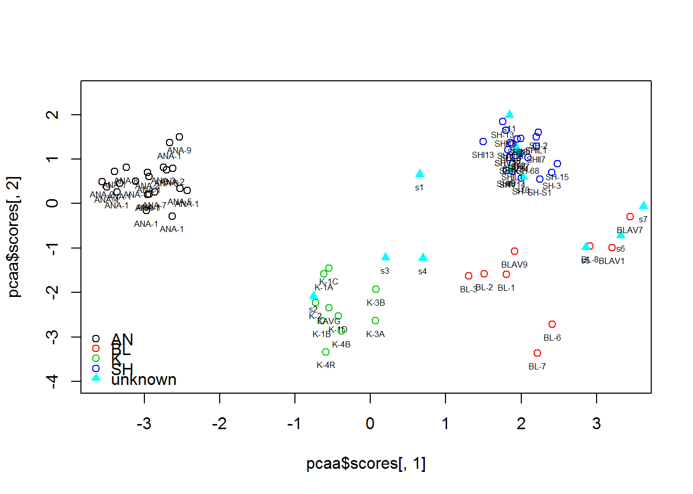

```r
ukn_data_a<-scale(ukn_data,center,scale)
ukn_pcaa<-ukn_data_a%*%pcaa$loadings
plot(pcaa$scores[,2],pcaa$scores[,3],col=prop[,3],ylim=c(-4,2.5))
points(ukn_pcaa[,2],ukn_pcaa[,3],col=5,pch=17)
text(pcaa$scores[,2],pcaa$scores[,3],labels=prop[,1],cex=.5,pos=1)
text(ukn_pcaa[,2],ukn_pcaa[,3],labels=ukn_prop[,1],cex=.5,pos=1)
legend("bottomleft",col=1:5,pch=c(1,1,1,1,17),c("AN", "BL", "K", "SH","unknown"),bty='n',y.intersp=.5)
```

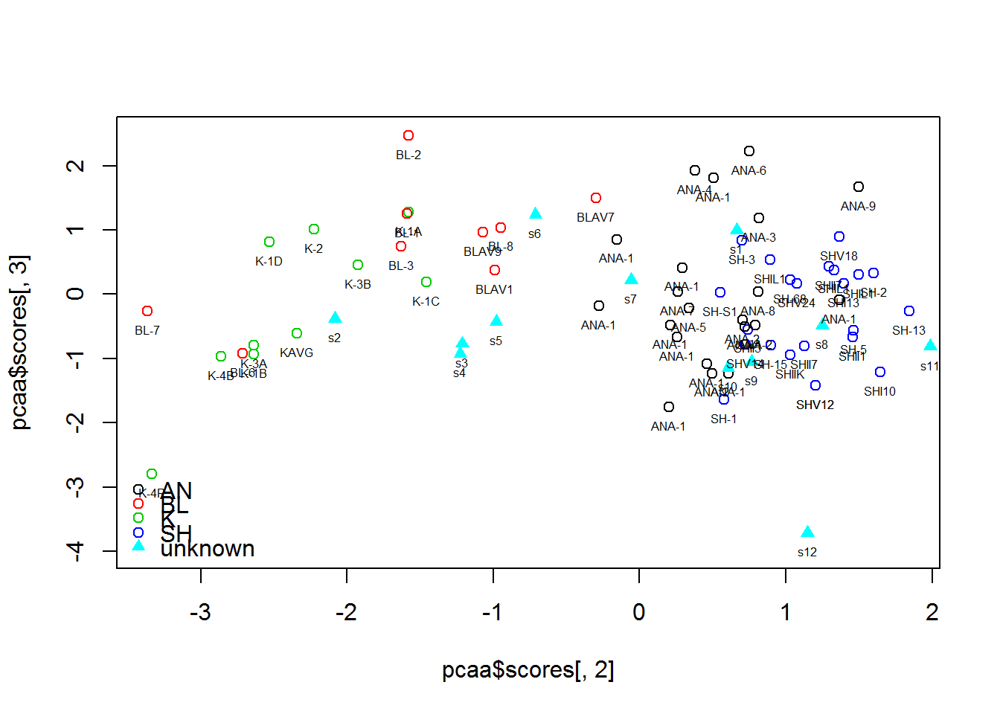

We would again assign 5 samples to SH with the exception of (s8, s9, s10, s11, and s12).  3 samples (s5, s6, and s7) would be assigned to BL while only 1 sample (s2) would clearly be assigned to K.  3 samples would not be clearly assigned (s1 - likely SH, s3 and s4 - either K or BL).

```r
assignpcaa<-c("u","K","u","u","BL","BL","BL","SH","SH","SH","SH","SH")
```
No samples have been assigned to different groups than the unscaled data, but several points have not been assigned at all.

#####3.) Hierarchical Clustering

```r
data3<-rbind(data,ukn_data)
data3<-scale(data3,center,scale)
prop3<-rbind(prop,ukn_prop)
h2<-hclust(dist(data3),"ward.D")
plot(h2, label=prop3[,1],cex=.8)
```

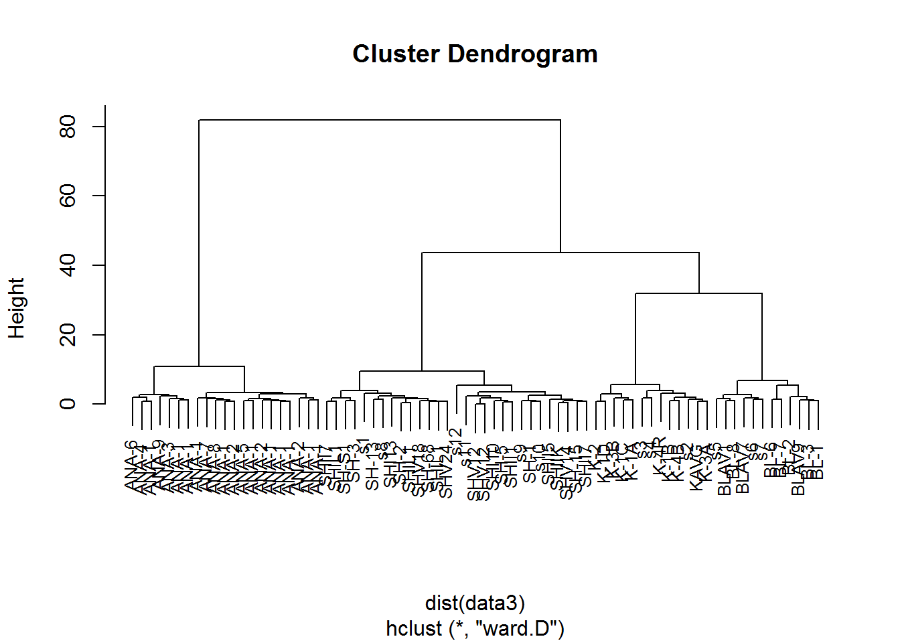


```r
assignhc<-c("SH","K","K","K","BL","BL","BL","SH","SH","SH","SH","SH")
assign<-cbind(1:12,assignpca,assignpcaa,assignhc)
colnames(assign)<-c("Sample ","PCA ","Auto-scaled_PCA ","Hierarchical_clustering ")
kable(assign,"html")
```

<table>
 <thead>
  <tr>
   <th style="text-align:left;"> Sample  </th>
   <th style="text-align:left;"> PCA  </th>
   <th style="text-align:left;"> Auto-scaled_PCA  </th>
   <th style="text-align:left;"> Hierarchical_clustering  </th>
  </tr>
 </thead>
<tbody>
  <tr>
   <td style="text-align:left;"> 1 </td>
   <td style="text-align:left;"> BL </td>
   <td style="text-align:left;"> u </td>
   <td style="text-align:left;"> SH </td>
  </tr>
  <tr>
   <td style="text-align:left;"> 2 </td>
   <td style="text-align:left;"> K </td>
   <td style="text-align:left;"> K </td>
   <td style="text-align:left;"> K </td>
  </tr>
  <tr>
   <td style="text-align:left;"> 3 </td>
   <td style="text-align:left;"> K </td>
   <td style="text-align:left;"> u </td>
   <td style="text-align:left;"> K </td>
  </tr>
  <tr>
   <td style="text-align:left;"> 4 </td>
   <td style="text-align:left;"> BL </td>
   <td style="text-align:left;"> u </td>
   <td style="text-align:left;"> K </td>
  </tr>
  <tr>
   <td style="text-align:left;"> 5 </td>
   <td style="text-align:left;"> BL </td>
   <td style="text-align:left;"> BL </td>
   <td style="text-align:left;"> BL </td>
  </tr>
  <tr>
   <td style="text-align:left;"> 6 </td>
   <td style="text-align:left;"> BL </td>
   <td style="text-align:left;"> BL </td>
   <td style="text-align:left;"> BL </td>
  </tr>
  <tr>
   <td style="text-align:left;"> 7 </td>
   <td style="text-align:left;"> BL </td>
   <td style="text-align:left;"> BL </td>
   <td style="text-align:left;"> BL </td>
  </tr>
  <tr>
   <td style="text-align:left;"> 8 </td>
   <td style="text-align:left;"> SH </td>
   <td style="text-align:left;"> SH </td>
   <td style="text-align:left;"> SH </td>
  </tr>
  <tr>
   <td style="text-align:left;"> 9 </td>
   <td style="text-align:left;"> SH </td>
   <td style="text-align:left;"> SH </td>
   <td style="text-align:left;"> SH </td>
  </tr>
  <tr>
   <td style="text-align:left;"> 10 </td>
   <td style="text-align:left;"> SH </td>
   <td style="text-align:left;"> SH </td>
   <td style="text-align:left;"> SH </td>
  </tr>
  <tr>
   <td style="text-align:left;"> 11 </td>
   <td style="text-align:left;"> SH </td>
   <td style="text-align:left;"> SH </td>
   <td style="text-align:left;"> SH </td>
  </tr>
  <tr>
   <td style="text-align:left;"> 12 </td>
   <td style="text-align:left;"> SH </td>
   <td style="text-align:left;"> SH </td>
   <td style="text-align:left;"> SH </td>
  </tr>
</tbody>
</table>

Based on our mis-match between our methods, we would be wary of assigning samples 1 and 4 definitively.

####e) K-means Clustering


(E) Perform either K-means clustering OR model-based clustering on the
quarry data using whatever preprocessing you regard as appropriate.
Explain the results you see. Do they agree with the hierarchical clustering
and PCA?
